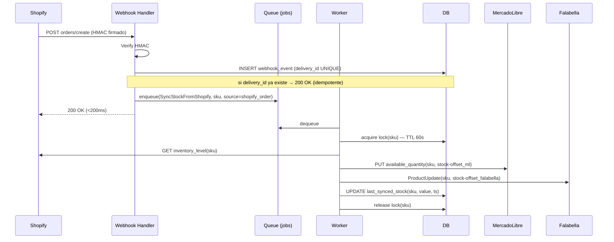
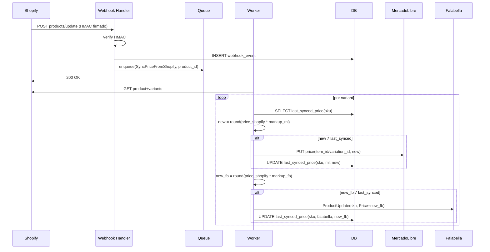

# ARCHITECTURE.md — Arquitectura objetivo

> Propuesta de cómo debería quedar el sistema para llegar a "productivo, estable y escalable".
> Lee `AUDIT.md` primero — esta propuesta resuelve los problemas listados ahí.

---

## 0. Principios de diseño

1. **Shopify es la única fuente de verdad.** Todo cálculo de stock y precio para marketplaces se deriva de Shopify. ML y Falabella son *espejos lossy* (con offset y markup).
2. **Webhooks idempotentes con identidad fuerte.** Cada delivery trae una `delivery_id` única; la procesamos a lo más una vez.
3. **Asincronía con cola.** El webhook handler hace 3 cosas: validar firma, guardar evento, encolar. Nada de lógica de negocio en el handler HTTP.
4. **Worker singleton con lock por SKU.** Solo un worker procesa un SKU a la vez, evitando races sin necesidad de "flag global anti-loop".
5. **DB con estado del mundo + log de eventos.** Mapeos, snapshots y eventos persisten. Reinicios no pierden nada.
6. **Reconciliación periódica.** Un job barre Shopify y compara con marketplaces, corrige drift.
7. **Observabilidad mínima desde el día 1.** Logger estructurado, request IDs, métricas de cola y errores.

---

## 1. Diagramas de flujo (los 3 escenarios de venta + cambio de precio)

### 1.1 Venta en Shopify → ML + Falabella



**Anti-loop aquí:** ninguna venta en Shopify dispara webhook desde ML/Falabella, así que no hay nada que detener. El único riesgo era `inventory_levels/update` redundante después de `orders/create` — resuelto por **lock por SKU** + **debouncing**: si llega un segundo evento para el mismo SKU mientras el lock está tomado, se descarta (porque el primer evento ya va a leer el estado más reciente cuando ejecute).

### 1.2 Venta en ML → Shopify (sin loop)

```mermaid
sequenceDiagram
    participant ML as MercadoLibre
    participant H as Webhook Handler
    participant Q as Queue
    participant W as Worker
    participant DB as DB
    participant S as Shopify
    participant F as Falabella

    ML->>H: POST orders_v2 (topic=orders_v2, resource=/orders/123)
    H->>DB: INSERT webhook_event (delivery_id=topic+resource+received_at)
    H->>Q: enqueue(ProcessMarketplaceOrder, source=ml, order_id=123)
    H-->>ML: 200 OK

    W->>ML: GET /orders/123
    W->>DB: SELECT order_state(ml, 123) — ya procesada?
    alt ya procesada
        W->>DB: log skip
    else nueva
        loop por cada line item
            W->>DB: SELECT sku from sku_mapping(ml_variation_id)
            W->>DB: acquire lock(sku)
            W->>S: POST inventory_levels/set {sku, current - qty}
            Note right of W: usar SET ABSOLUTO con compare-and-swap<br>(idempotente; si se reintenta, no doble-descuenta)
            W->>DB: INSERT stock_event(source=ml, sku, qty, order_id)
            W->>DB: release lock
        end
        W->>DB: UPDATE order_state(ml, 123, processed)
        W->>Q: enqueue(RedistributeStock, sku, source=ml_sale)
    end

    W->>Q: dequeue RedistributeStock
    W->>S: GET inventory_level(sku)
    W->>F: ProductUpdate(sku, ...)
    Note right of W: NO se actualiza ML aquí — el origen es ML,<br>su stock ya quedó descontado del lado de ML por la venta.
```

**Anti-loop aquí:** después de descontar Shopify, redistribuimos **solo a Falabella** (la `source=ml_sale` lo indica). Shopify dispara `inventory_levels/update`, pero el worker ve la nueva lectura ya consistente con lo que acaba de escribir → no genera trabajo (debouncing por valor: si el último `last_synced_stock` ya coincide, no hace nada).

### 1.3 Venta en Falabella → Shopify (sin loop)

Idéntico al flujo ML pero con `source=falabella_sale`, redistribuyendo **solo a ML**.

### 1.4 Cambio de precio en Shopify → ambos marketplaces



**Markup configurable por marketplace** (default 1.30) y por SKU si se quiere override en DB. **Nunca** se acepta cambio de precio desde ML o Falabella → no hay webhook entrante de precio.

---

## 2. Estrategia anti-loop — la decisión

### Opciones consideradas

| Opción | Cómo funciona | Pros | Contras |
|---|---|---|---|
| A. Flag in-memory por marketplace (actual) | Booleano global que ignora webhooks Shopify mientras se procesa orden externa | Simple | Roto en multi-instancia y en reinicios. Es lo que tienen hoy. |
| B. Idempotency keys por evento | Cada webhook tiene un id único; lo guardamos y rechazamos duplicados | Imprescindible siempre | No previene loops por *eco*, solo duplicados |
| C. Damping por timestamp | "Ignorar inventory_levels/update si dentro de N seg de mi último push" | Funciona ok | Tuning de N delicado; problemas en relojes desincronizados |
| D. Lock por SKU + debouncing por valor | Solo un worker procesa un SKU a la vez; descarta jobs cuyo target ya está en el estado deseado | Robusto multi-instancia; no requiere flags globales | Necesita Redis o DB para el lock |
| E. Source tagging + supresión | Etiquetar cada update con `source` y rechazar webhooks cuyo origen detectado es uno mismo | Limpio conceptualmente | Shopify no nos deja meter metadata en `inventory_levels`; hay que inferir |

### Lo que propongo: **B + D + E combinadas**

1. **B (idempotency)** siempre: tabla `webhook_events(delivery_id PRIMARY KEY, payload jsonb, received_at, status)`. Cualquier delivery repetido se ignora sin tocar nada más. Resuelve reintentos de Shopify/ML/Falabella.

2. **D (lock + debounce por valor)** es el corazón anti-loop:
   - Lock por SKU (`SELECT FOR UPDATE` en Postgres o `SET NX` en Redis, TTL ~30s) garantiza serialización.
   - Antes de hacer un PUT/POST a un marketplace, comparar el *valor deseado* con `last_synced_stock` / `last_synced_price` registrados en DB. **Si ya está sincronizado, no hacer la llamada.**
   - Esto rompe el loop por construcción: aunque Shopify nos eche un eco de `inventory_levels/update` después de que escribimos, al procesar el job el worker verá `last_synced_stock == stock_actual_shopify` → no-op → fin de la cadena.

3. **E (source tagging)** como capa lógica adicional:
   - Cada job en la cola lleva `source` (`shopify_order`, `shopify_inventory`, `ml_sale`, `falabella_sale`, `reconciliation`).
   - El worker usa `source` para decidir A QUÉ marketplaces propagar (ej. `ml_sale` no propaga a ML).
   - No depende del estado in-memory; vive en el job.

### ¿Por qué descarté un "flag global"?
Porque en cualquier sistema con cola, multi-worker, restart resiliente, un booleano global **se rompe**. El lock por SKU es localmente lo mismo pero correcto.

---

## 3. Stack final recomendado

### A mantener
- **Node.js + Express**. Es lo que hay, funciona, todo el equipo (tú con Cursor) puede iterarlo.
- **axios** para clientes externos.
- **`mercadolibre-api.js` y `falabella-api.js`** como capa de cliente — extraer la **lógica de sync** afuera, dejar solo las funciones HTTP puras.
- **HMAC ya pre-instalado** (módulo built-in `crypto`).

### A cambiar
- Reorganizar `webhook-server.js` en módulos:
  ```
  src/
    server.js              # express setup, monta rutas
    routes/
      webhooks.shopify.js  # /webhooks/shopify/*
      webhooks.ml.js
      webhooks.falabella.js
      admin.js             # /sync-all, /health, /test-sync (con auth)
    middleware/
      verify-shopify-hmac.js
      verify-ml.js
      verify-falabella.js
      basic-auth.js        # para endpoints admin
    services/
      stock-sync.js        # orquesta cálculos stock + propagación
      price-sync.js        # orquesta cálculos precio + propagación
      reconciler.js        # job de reconciliación
    clients/
      shopify.js           # cliente Shopify (extraído, sin lógica de negocio)
      mercadolibre.js
      falabella.js
    db/
      index.js             # conexión + migraciones
      repositories/
        sku-mapping.js
        webhook-events.js
        stock-state.js
        price-state.js
        order-state.js
    queue/
      worker.js            # consumer
      jobs.js              # productores
    util/
      logger.js            # pino
      lock.js              # locks por SKU
      money.js             # redondeo/CLP
  ```
- **Dropear** todo el código de reporting/billing/publicidad/refunds de `mercadolibre-api.js` y `shopify-api.js` que no se usa en sync (queda en historia git si lo necesitan).

### A agregar
| Decisión a tomar contigo | Opciones | Recomendación |
|---|---|---|
| **Base de datos** | (a) **Postgres** (managed: Neon, Supabase, Railway). (b) SQLite con disco persistente. | **Postgres en Neon free tier**: serverless, generoso para este tamaño, soporta multi-conexión, listo para escalar. SQLite también vale si el host es 1 sola VM persistente; menos lío operacional, pero te ata a single-instance. |
| **Cola de trabajos** | (a) **BullMQ** (Redis). (b) **pg-boss** (Postgres). (c) cola in-memory + persistencia DIY. | **pg-boss**: si elegimos Postgres, evitamos meter Redis y reutilizamos la DB para cola. Si vas con SQLite, BullMQ no sirve y conviene `better-queue` + persistencia file. |
| **Logger** | (a) **pino**. (b) winston. (c) seguir con console.log | **pino**: rápido, JSON estructurado, integra con todos los hosts. |
| **Validación** | (a) **zod**. (b) ajv | **zod**: idiomático en Node moderno, schemas reutilizables como tipos. |
| **Hosting** | Render / Fly / Railway / Vercel / VPS | Confírmame cuál es el actual. Si están en Render free → recomiendo subir a Render Starter ($7/mes) o Fly.io (más barato y soporta volumen persistente). Vercel **no sirve** porque los serverless functions matan colas/locks. |
| **Tests** | (a) **vitest**. (b) jest. (c) node --test | **vitest**: rápido, ES modules nativos, buen DX. |

> **Te pregunto antes de avanzar:**
> 1. ¿Postgres (Neon/Supabase) o SQLite local con volumen?
> 2. ¿Hosting actual? ¿Migrar al mismo o cambiar?
> 3. ¿Mantenemos `meli-sku-mapping.js` como semilla inicial de la tabla `sku_mapping` o lo migramos a algo que se autogenere desde ML al primer arranque?

---

## 4. Esquema de base de datos propuesto

> Postgres, sintaxis Postgres. Si elegimos SQLite, los `jsonb` pasan a `text JSON` y los locks usan otra estrategia.

```sql
-- Mapeo SKU ↔ identificadores en cada plataforma. Reemplaza meli-sku-mapping.js.
CREATE TABLE sku_mapping (
  sku                  text PRIMARY KEY,
  shopify_variant_id   bigint NOT NULL,
  shopify_inventory_item_id bigint NOT NULL,
  ml_item_id           text,
  ml_variation_id      bigint,
  falabella_seller_sku text,                 -- por default = sku, pero override permitido
  active               boolean DEFAULT true,
  notes                text,
  created_at           timestamptz DEFAULT now(),
  updated_at           timestamptz DEFAULT now()
);
CREATE INDEX idx_sku_mapping_ml_variation ON sku_mapping(ml_variation_id) WHERE ml_variation_id IS NOT NULL;
CREATE INDEX idx_sku_mapping_ml_item ON sku_mapping(ml_item_id) WHERE ml_item_id IS NOT NULL;

-- Estado conocido por SKU + plataforma. Se usa para "debounce por valor".
CREATE TABLE platform_state (
  sku        text NOT NULL REFERENCES sku_mapping(sku) ON DELETE CASCADE,
  platform   text NOT NULL CHECK (platform IN ('shopify', 'mercadolibre', 'falabella')),
  stock      integer,
  price      numeric(12,2),
  last_synced_at  timestamptz,
  last_source     text,                       -- 'shopify_order', 'ml_sale', 'reconciliation', etc.
  PRIMARY KEY (sku, platform)
);

-- Log de eventos entrantes (idempotencia).
CREATE TABLE webhook_events (
  delivery_id  text PRIMARY KEY,             -- X-Shopify-Webhook-Id, o resource+topic+ts para ML
  source       text NOT NULL,                -- 'shopify', 'mercadolibre', 'falabella'
  topic        text,
  payload      jsonb NOT NULL,
  status       text NOT NULL DEFAULT 'received',  -- received|enqueued|processed|failed|ignored
  received_at  timestamptz DEFAULT now(),
  processed_at timestamptz,
  error        text
);
CREATE INDEX idx_webhook_events_status ON webhook_events(status, received_at);

-- Órdenes externas procesadas (segunda capa de idempotencia, granularidad orden).
CREATE TABLE marketplace_orders (
  platform   text NOT NULL,
  order_id   text NOT NULL,
  status     text NOT NULL,                  -- new|processing|processed|partial|failed
  raw        jsonb,
  items      jsonb,                          -- [{sku, qty, ml_item, variation_id}]
  processed_items integer DEFAULT 0,
  failed_items integer DEFAULT 0,
  first_seen  timestamptz DEFAULT now(),
  processed_at timestamptz,
  PRIMARY KEY (platform, order_id)
);

-- Stock events (log append-only para auditoría).
CREATE TABLE stock_events (
  id           bigserial PRIMARY KEY,
  sku          text NOT NULL,
  source       text NOT NULL,                -- shopify_order|ml_sale|falabella_sale|sync_all|reconciliation
  source_ref   text,                         -- order_id u otro id correlacionable
  delta        integer,                      -- negativo si descuento, positivo si rebalance
  new_value    integer NOT NULL,
  platform     text NOT NULL,                -- a qué plataforma se aplicó
  ok           boolean NOT NULL,
  error        text,
  ts           timestamptz DEFAULT now()
);
CREATE INDEX idx_stock_events_sku_ts ON stock_events(sku, ts DESC);

-- Locks por SKU (alternativa a Redis si usamos pg).
CREATE TABLE sku_locks (
  sku         text PRIMARY KEY,
  owner       text NOT NULL,
  acquired_at timestamptz DEFAULT now(),
  expires_at  timestamptz NOT NULL
);
```

**Migración del mapeo actual:** seed script lee `meli-sku-mapping.js` + saca de Shopify `getAllProducts()` + saca de Falabella (si SKU coincide) → llena `sku_mapping`. Una sola vez.

---

## 5. Estrategia de colas / workers

### Recomendación: **pg-boss sobre Postgres**, mismo binario hace de servidor HTTP y de worker.

```
process: webhook-server
  - inicia express (rutas /webhooks/*, /admin/*, /health)
  - inicia pg-boss worker (mismo proceso o separable después)
  - inicia scheduler (reconciler cada N min)
```

### Tipos de job

| Job | Productor | Idempotencia | Concurrencia |
|---|---|---|---|
| `sync.stock.from-shopify` | webhook Shopify orders/create, inventory/update | dedup key = sku (debounce) | global N=4, por-sku 1 (lock) |
| `sync.price.from-shopify` | webhook Shopify products/update | dedup key = product_id | global 4 |
| `process.marketplace-order` | webhook ML, webhook Falabella | dedup key = `platform:order_id` | global 4 |
| `redistribute.stock` | después de procesar orden externa | dedup key = sku | global 4 |
| `reconcile.stock` | scheduler (cada 15 min) | — | 1 |

### Política de reintentos
- 3 reintentos exponenciales (1s, 10s, 60s) ante error transitorio (5xx, timeouts).
- Errores de negocio (SKU no mapeado, payload inválido) → marcar `failed` y mover a tabla de errores. Sin reintento automático.
- DLQ implícita: cualquier job que excede reintentos queda en `pgboss.archive`. Endpoint admin `/admin/failed-jobs` para inspeccionar.

---

## 6. Estrategia de reintentos y fallos

| Escenario | Comportamiento propuesto |
|---|---|
| Shopify 5xx / timeout | Reintento con backoff (3x). Si falla todo, job a DLQ, log structured con sku+source. |
| ML 5xx / timeout | Reintento. Si excede, DLQ. Stock queda desincronizado hasta próxima reconciliación. |
| ML 401 | Refresh token + retry una vez (igual que hoy). |
| ML 429 | Reintento con `Retry-After` si viene; si no, backoff (igual que hoy pero con jitter). |
| Falabella E009 | Job a DLQ, marcar SKU con `falabella_unavailable_until = now() + 24h` (no en memoria; en DB). Endpoint admin para limpiar manualmente. |
| Webhook con HMAC inválido | 401, log "suspicious", contador de intentos por IP. |
| Webhook con payload inválido | 400, log. |
| DB caída | Webhook responde 503; el origen reintentará. |

---

## 7. Estrategia de monitoreo

### Logs estructurados (pino)
- JSON line por evento.
- Campos comunes: `ts`, `level`, `request_id`, `delivery_id`, `sku`, `source`, `platform`, `action`, `ms`, `error`.
- Niveles: `debug` (off en prod), `info`, `warn`, `error`.

### Métricas mínimas
Exponer `/metrics` (texto Prometheus simple, sin dependencia extra):
- `webhooks_received_total{source}` 
- `webhooks_processed_total{source,status}`
- `sync_duration_seconds{platform,action}`
- `queue_depth{job}`
- `queue_failed_total{job}`
- `marketplace_api_errors_total{platform,status_code}`

Hosting tipo Render no tiene Prometheus nativo; alternativas:
- Mandar a **Better Stack / Logtail / Axiom** vía stdout (gratis hasta cierto volumen) — todos parsean JSON line.
- Métricas a **Grafana Cloud free** vía remote_write.

### Alertas básicas (vía el servicio de logs)
- Cola con >50 jobs en pending por más de 5 min.
- Cualquier `error` con `source=shopify_hmac_invalid`.
- DLQ no vacía.
- Reconciliación encontró >5 SKUs con drift.

### Endpoint admin
- `GET /admin/health` (auth basic) → estado DB, cola, marketplaces (ping a cada uno).
- `GET /admin/skus/{sku}` → mapping + estado en cada plataforma + últimos 20 eventos.
- `POST /admin/force-sync/{sku}` → re-enqueue.
- `GET /admin/dlq` → jobs fallidos.

---

## 8. Plan de migración (FASE 3) — orden propuesto

Cada etapa **deja el sistema funcional** (no big-bang). Cuando un módulo nuevo está listo, swap con el viejo.

1. **Setup base** (sin tocar la lógica actual):
   - Crear DB + migraciones.
   - Agregar logger pino.
   - Reorganizar carpetas (`src/`) preservando comportamiento.
   - Agregar zod para validar envs en boot.
   - Agregar verificación HMAC en webhooks Shopify (puede ir con flag para no romper si secret no está configurado todavía).
   - **Punto de verificación: el servidor sigue funcionando idéntico, pero loggea estructurado y rechaza HMAC inválido.**

2. **Mapping SKU a DB**:
   - Seed desde `meli-sku-mapping.js` + Shopify + Falabella.
   - Reemplazar lecturas in-memory.
   - Endpoint admin para listar/editar mapping.
   - **Verificación: agregar un SKU nuevo sin tocar código.**

3. **Cola + worker** (single sync path primero, Shopify → ML):
   - Webhook orders/create solo encola.
   - Worker procesa con lock por SKU y debounce por valor.
   - **Verificación: reiniciar el server mientras hay un job en vuelo → el job se recupera al reiniciar.**

4. **Procesamiento de ventas ML**:
   - Migrar `processMercadoLibreOrder` al worker.
   - Implementar `inventory_levels/set` con compare-and-swap (no más `adjust` relativo).
   - **Verificación: simular orden ML duplicada (mismo `delivery_id`) → procesa una vez.**

5. **Ventas Falabella** (mismo patrón).

6. **Sync de precios**:
   - Webhook `products/update` de Shopify.
   - Lógica `markup_ml=1.30`, `markup_falabella=1.30` (configurables en DB por SKU si se quiere).
   - **Verificación: cambiar precio en Shopify → ver ambos marketplaces actualizados.**

7. **Reconciliación**:
   - Job cada 15 min compara Shopify vs marketplaces.
   - Marca drift, opcionalmente auto-corrige.

8. **Tests**:
   - Unit: cálculo offsets/markups, lock acquire, validaciones zod.
   - Integration: HMAC verification, full webhook handlers con DB en memoria.
   - E2E (con mocks de APIs externas): los 4 escenarios del punto 1.

9. **Docs finales**: README de deploy + env vars + runbook de troubleshooting.

---

## 9. Cosas que NO voy a meter (anti-overengineering)

- ❌ Microservicios. Es un monolito pequeño y debe seguir siéndolo.
- ❌ Event sourcing puro. El log `stock_events` es suficiente.
- ❌ Kubernetes / Docker compose elaborado. Render/Fly/Railway cubren esto.
- ❌ Multi-tenant. Es una sola marca (Valiz).
- ❌ Más colas que pg-boss. Una sola.
- ❌ Cache distribuido. Postgres alcanza para los volúmenes esperados.

---

## 10. Decisiones que necesito de ti antes de codear

1. **DB**: ¿Postgres (Neon) o SQLite con volumen?
2. **Hosting**: ¿Render / Fly / Railway / otro? ¿Plan actual?
3. **Sync de precios**: ¿la regla `precio_ml = precio_shopify * 1.3` aplica para ambos marketplaces o cada uno tiene markup distinto?
4. **Redondeo de precios**: ¿al peso entero (CLP)? ¿al múltiplo de 10? ¿al múltiplo de 100?
5. **Stock offset**: ¿se queda `1` para ambos marketplaces, o necesitas diferenciar? ¿override por SKU?
6. **Reconciliación**: ¿auto-corrige el drift o solo alerta?
7. **Catálogo**: ¿agregar productos nuevos cuántas veces al mes? (Esto decide si la UI admin vale la pena ahora o en una v2).

---

> Cuando me confirmes esto + apruebes este documento + `AUDIT.md`, arrancamos la Fase 3 paso a paso, parando para verificar después de cada etapa.
